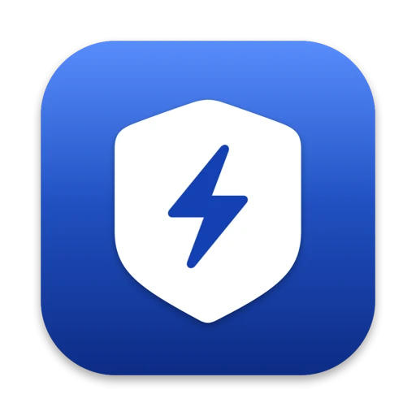
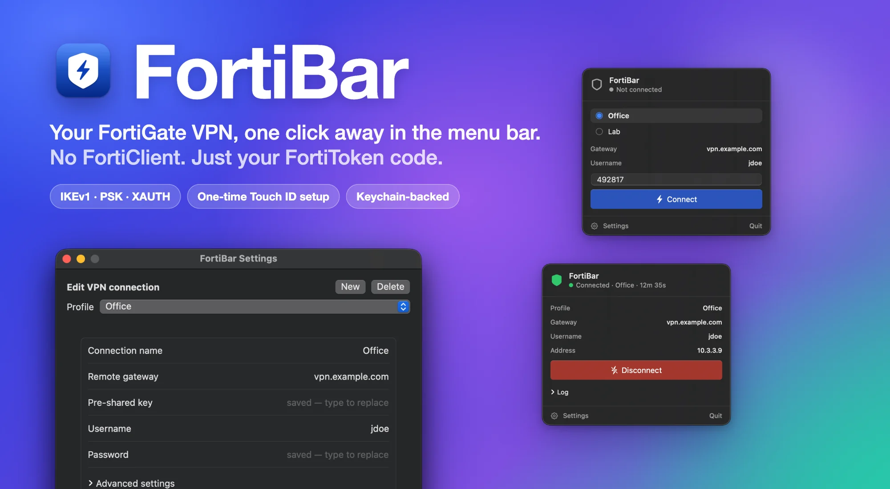

<p align="center">
  
</p>

<h1 align="center">FortiBar</h1>

<p align="center">
  A native macOS menu bar app for FortiGate IPsec VPNs — IKEv1 with a pre-shared key, XAUTH and FortiToken —
  <strong>without FortiClient</strong>.<br>
  Save your profiles once, then connect with nothing but your FortiToken code: no password prompt,
  no Touch ID, no <code>sudo</code> on each connect.
</p>

<p align="center">
  <a href="#install">
    
  </a>
  <a href="https://github.com/ahmadarif-lab/fortibar/releases/latest">
    
  </a>
  
  
</p>

<p align="center">
  
</p>

## Why FortiBar

Connecting to a FortiGate with FortiToken usually means opening the FortiClient window, picking the
VPN, typing the code and waiting. FortiBar lives in the menu bar and cuts it down to the one thing
only you can provide: the code. Your gateway, pre-shared key, username and password are saved once;
the rest happens in a small background helper that is set up with a single approval.

## Install

> [!TIP]
> **Homebrew is the easiest way — one command, and it pulls in strongSwan for you:**
>
> ```sh
> brew install --cask ahmadarif-lab/tap/fortibar
> ```
>
> It adds the `ahmadarif-lab/tap` tap, installs the [strongSwan](https://www.strongswan.org) engine
> FortiBar drives, and clears the quarantine flag so the app opens straight away.

Then open **FortiBar** from Applications and follow [First run](#first-run).

### Manual install (DMG)

1. Install the engine: `brew install strongswan`
2. Download `FortiBar.dmg` from [Releases](https://github.com/ahmadarif-lab/fortibar/releases/latest)
   and drag the app into `Applications`.
3. The app is ad-hoc signed rather than signed with a Developer ID and notarized, so clear the
   quarantine flag once (Homebrew does this for you):

   ```sh
   xattr -dr com.apple.quarantine /Applications/FortiBar.app
   ```

   Or open it once through **System Settings → Privacy & Security → Open Anyway**.

### Updating

FortiBar checks GitHub for a new release at launch and every 12 hours, and shows a notification and a
banner in the menu when one is out. The banner links to the release notes and copies the upgrade
command; turn the check off or run it by hand under **Settings → General**.

```sh
brew upgrade --cask fortibar
```

If an update changes the helper, FortiBar shows **Update helper** in Settings; installing it asks for
approval once, like the first time.

## First run

1. Click the shield in the menu bar → **Settings**.
2. Fill in your connection — name, remote gateway, pre-shared key, username and password — and click
   **Save**. The key and password go to your macOS keychain.
3. In **System**, click **Install helper** and approve it with Touch ID (or your password). This is the
   only time FortiBar needs administrator rights; see [How it works](#how-it-works).
4. Back in the menu, type your FortiToken code and click **Connect**.

From then on connecting is just: open the menu, type the code, **Connect**.

FortiBar starts itself at login from the first launch (via `SMAppService`). Turn that off under
**Settings → General**, or in System Settings → General → Login Items.

## What it does

- Connect and disconnect from the menu bar; the icon shows the state (outline shield when idle,
  blinking while connecting, solid green when connected)
- Several profiles, one tunnel at a time; pick the profile while disconnected
- Saved pre-shared key and password per profile in the macOS keychain — editable any time from
  Settings. The FortiToken code is never stored.
- Split tunnelling: only the subnets you list (default `10.0.0.0/8`, `172.16.0.0/12`,
  `192.168.0.0/16`) go through the VPN, and you can pin specific LAN ranges to stay local. Your normal
  internet traffic is untouched.
- Notices the tunnel dropping (dead peer) and cleans up its routes so the Mac is never left
  half-configured
- Notifications on connect/disconnect, and a small activity log in the menu
- Tells you when a new release is available (the only network request FortiBar makes itself, to
  `api.github.com`; it sends nothing but a `User-Agent`)

## Requirements

- macOS 14 (Sonoma) or later. Release builds are Apple silicon; on Intel, build from source (untested).
- [strongSwan](https://www.strongswan.org) from Homebrew (`brew install strongswan`; the cask installs it)
- A FortiGate dial-up IPsec VPN using **IKEv1 aggressive mode, pre-shared key and XAUTH**, with or
  without FortiToken two-factor
- Xcode command line tools with Swift 5.10+, only if you build from source

Not supported: IKEv2, SSL-VPN, certificate authentication, IPv6 routes, and more than one tunnel at
a time.

## How it works

```
FortiBar.app ── Unix socket (owner only) ──▶ FortiBarHelper (root LaunchDaemon)
                                               ├─ starts its own strongSwan daemon (charon)
                                               ├─ loads the connection and secrets over VICI
                                               ├─ routes your subnets through the tunnel interface
                                               └─ watches the tunnel and cleans up if it dies
```

Setting up IPsec needs root: starting the daemon, installing kernel security associations, adding
routes. Rather than asking for your password on every connect, FortiBar installs a small helper as a
LaunchDaemon **once**. The app then talks to it over a local socket and only has to supply the
FortiToken code.

The helper is deliberately narrow:

- Its socket (`/var/run/fortibar-helper.sock`) is mode `0600`, owned by the user who installed it, and
  every connection is checked with `getpeereid`.
- It understands four requests — `ping`, `status`, `connect`, `disconnect` — and validates every
  parameter (gateway, username, proposals, subnets, code format). It never runs a shell or any
  command supplied by the caller; the tools it calls (`charon`, `route`) use fixed paths and argument
  arrays.
- Secrets are loaded into strongSwan over its VICI control socket, never written to disk, and are
  masked in everything the helper logs or returns. The XAUTH secret (password + code) is dropped from
  the daemon as soon as the handshake finishes.
- Crash recovery state (`/var/run/fortibar/state.json`, root only) holds routes and a PID, no secrets.

The helper trusts the logged-in user — the same level of trust as that user's keychain. Anyone who can
already run code as you can ask it to connect or disconnect, but not make it run arbitrary commands.

**Why strongSwan and not FortiClient's engine?** FortiBar talks to the gateway itself, so FortiClient
doesn't need to be installed at all. The Homebrew strongSwan build includes IKEv1, XAUTH and the macOS
kernel interfaces this needs.

### Uninstall

In **Settings → System**, click **Remove helper** (disconnect first), then:

```sh
brew uninstall --cask --zap fortibar
```

Without the app, remove the helper directly:

```sh
sudo /Applications/FortiBar.app/Contents/Resources/install-helper.sh uninstall
```

## Troubleshooting

| Message | What to do |
| --- | --- |
| *The helper is not installed* / *needs an update* | Settings → System → Install (or Update) helper. |
| *strongSwan is not installed* | `brew install strongswan`, then reopen Settings. |
| *Authentication failed or timed out* | Check the password, and use a fresh FortiToken code — a code works once, and repeated failures can lock the account on the gateway. |
| *The gateway did not respond* | Check the gateway address and that UDP 500/4500 is reachable from your network. |
| *Another strongSwan daemon (charon) is already running* | Stop the other IPsec daemon first; FortiBar runs its own. |
| Some subnets don't work | A route may already exist for it; the connection notice lists routes that couldn't be installed. |

Logs: the helper writes to `/var/log/fortibar-helper.log`, and the strongSwan daemon to
`/var/run/fortibar/charon.log` for as long as a connection exists (secrets are not logged).

## Build from source

```sh
./Scripts/run_dev.sh             # run the app from source (temporary Dock icon, no login item)
swift build                      # app + helper (debug)
swift test                       # VICI codec and input validation tests
./Scripts/build_app.sh           # packages dist/FortiBar.app (signs with your Apple Development
                                 # identity if you have one, ad-hoc otherwise)
./Scripts/package_release.sh     # also builds the DMG and prints its sha256
```

A stable signing identity matters: ad-hoc signatures change on every build, which makes macOS ask
again before letting the app read its keychain items.

To exercise the helper without the UI (installs it with `sudo`, which accepts Touch ID if enabled):

```sh
sudo Scripts/install-helper.sh install "$PWD/.build/release/FortiBarHelper" "$(id -u)"
Scripts/test-helper.sh creds.txt "ping -c 3 <host inside the VPN>"   # asks for a FortiToken code
sudo Scripts/install-helper.sh uninstall
```

`./Scripts/screenshots.sh` regenerates the app screenshots in `Resources/screenshots` (as WebP; needs
`brew install webp`) from a built-in demo mode (`FORTIBAR_DEMO`, made-up profiles — it never reads your
keychain, helper or saved profiles). `hero.webp` is composed from them.

Bump `HelperProtocol.version` whenever the helper changes, so existing installs offer **Update helper**.

| Path | Role |
| --- | --- |
| `Sources/FortiBar` | menu bar app (SwiftUI + AppKit) |
| `Sources/FortiBarHelper` | the root daemon |
| `Sources/FortiBarCore` | shared code: VICI client, helper protocol and validation, keychain, profiles |
| `Scripts` | build, release, screenshot, helper install and test scripts |

## License

MIT
